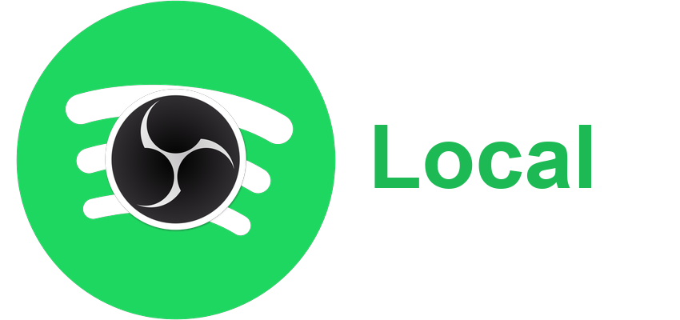
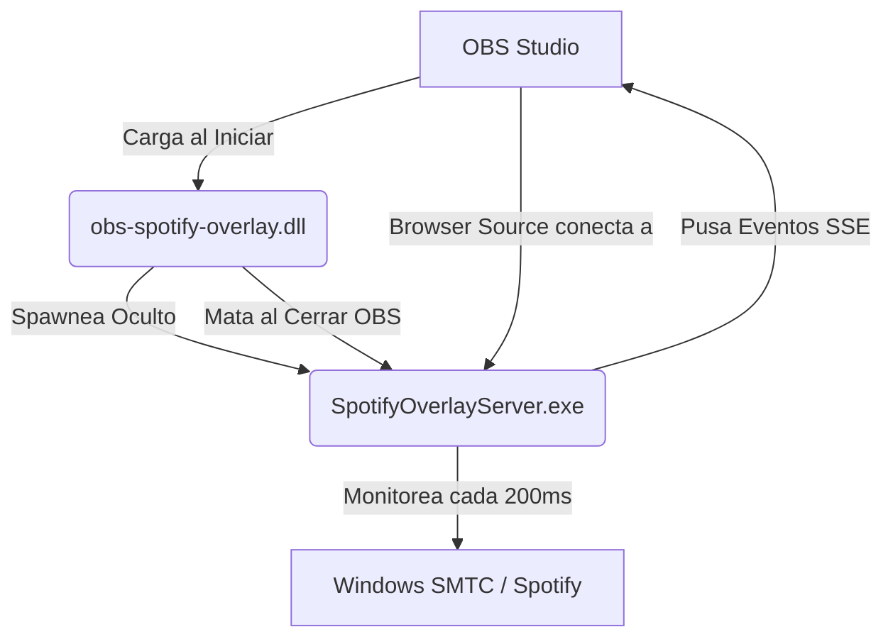

# 🎵 Spotify Now Playing Overlay para OBS Studio

<p align="center">
  
</p>

[](https://microsoft.com/windows)
[](https://obsproject.com/)
[](https://github.com/)

Un widget moderno, elegante y reactivo para mostrar en OBS Studio la información de la canción que estás reproduciendo en Spotify (o cualquier otra aplicación multimedia de Windows), con barra de progreso animada, carátula giratoria y espectro de audio en tiempo real.

Este proyecto ha sido desarrollado en su totalidad mediante la metodología de **vibe-coding** bajo la **estructura y arquitectura idealizada por [alvarro71](https://github.com/alvarro71)**.

---

## ✨ Características Principales

* 🟢 **Detección Automática (Zero Config)**: No requiere cuentas de desarrollador de Spotify, iniciar sesión ni tokens de API. Utiliza el sistema de control de medios nativo de Windows (SMTC).
* 🎨 **Diseño Moderno (Glassmorphism)**: Interfaz premium con desenfoque de fondo, sombras realistas, tipografía elegante (fuente *Outfit*) y animación de rotación del álbum en tiempo real.
* ⚡ **Ultra Reactivo (Server-Sent Events)**: Comunicación bidireccional y de baja latencia entre el backend y el navegador mediante SSE (Server-Sent Events) a 200ms, evitando consultas repetitivas (polling).
* 📦 **Instalador Inteligente y Autocontenido**: Un único instalador gráfico en C# `.exe` de ~146 MB que lleva todo el runtime incrustado. Encuentra tu OBS Studio esté donde esté y lo deja listo.
* 🗑️ **Desinstalador Integrado**: Limpieza completa de los archivos del plugin directamente desde el instalador con confirmación de seguridad.
* 🔒 **100% Local y Seguro**: Funciona localmente en tu máquina sin enviar datos a servidores externos ni requerir conexión a Internet.

---

## 🛠️ Estructura del Proyecto (Estructura Idealizada por alvarro71)

El repositorio se ha organizado de manera limpia y modular, separando los componentes de desarrollo y archivando el código histórico:

```text
SPOTIFY-OBS-OVERLAY/
├── Instalador_Spotify_Overlay/
│   └── Instalar_Spotify_Overlay.exe  # <-- El instalador único autocontenido (distribuible)
├── OBS-PLUGIN/
│   ├── src/                         # Código fuente en C del plugin/wrapper de OBS
│   └── winforms-installer/          # Código fuente en C# del instalador gráfico (.NET 9)
├── server-package/
│   ├── server.js                    # Servidor backend (NodeJS) con el HTML/CSS inlined
│   └── package.json                 # Dependencias del servidor (SMTC monitor, Express)
├── old_archive/                     # Historial y desorden antiguo archivado (Electron, PHP, XAMPP)
└── README.md                        # Esta documentación
```

---

## 🚀 Guía de Instalación y Uso

### 1. Ejecuta el Instalador
1. Abre la carpeta [Instalador_Spotify_Overlay](file:///b:/SPOTIFY-LOCAL-BABYYYYYYYYYYYYYYYY-QUE-LE-DEN-A-LAS-PAGINAS-WEBS-A-PARTE/Instalador_Spotify_Overlay).
2. Ejecuta **`Instalar_Spotify_Overlay.exe`** (solicitará permisos de administrador para poder copiar los archivos en el directorio de plugins de OBS).
3. Haz clic en **Instalar ahora**.

### 2. Configura tu OBS Studio
1. **Abre OBS Studio** (o reinícialo si ya estaba abierto).
2. En la sección de **Fuentes**, haz clic en el botón `+` y selecciona **Navegador** (Browser).
3. Nómbrala como gustes (ej. *Spotify Overlay*) y configúrala con:
   * **URL**: `http://localhost:9274/`
   * **Ancho (Width)**: `450`
   * **Alto (Height)**: `150`
4. Haz clic en **Aceptar**.
5. ¡Pon música en Spotify y verás el widget aparecer automáticamente!

---

## ⚙️ ¿Cómo Funciona Bajo el Capó?

El ecosistema diseñado consta de tres componentes trabajando en armonía:



1. **El Wrapper nativo (`obs-spotify-overlay.dll` - 13 KB)**: Un plugin escrito en C que actúa como administrador de procesos. Al arrancar OBS, lanza `SpotifyOverlayServer.exe` en segundo plano sin ventana. Al cerrar OBS, mata el proceso para no dejar basura en memoria.
2. **El Servidor de Datos (`SpotifyOverlayServer.exe` - 40 MB empaquetado)**: Servidor NodeJS que expone una API REST y un canal de eventos SSE. Consulta las propiedades multimedia de Windows, extrae la carátula en Base64, el título, artista y progreso, y sirve el frontend inlined.
3. **El Frontend (HTML/CSS/JS)**: Se ejecuta en el navegador CEF interno de OBS. Recibe los eventos del servidor de forma reactiva y actualiza el disco giratorio, barra de progreso y textos con efectos fluidos.

---

## 🗑️ Desinstalación

Si deseas eliminar el plugin en el futuro:
1. Ejecuta de nuevo `Instalar_Spotify_Overlay.exe`.
2. Haz clic en **Desinstalar**.
3. Confirma la acción en el cuadro de diálogo. El instalador eliminará de forma segura la DLL y el ejecutable del servidor de la carpeta de OBS.

---

## ⚡ Vibe-Coding & Créditos

Este proyecto es un testimonio del poder del **Vibe-Coding**, donde la visión y directrices de diseño de **alvarro71** se tradujeron en código limpio, modular y funcional a través de un asistente de inteligencia artificial.

* **Idealización y Estructura**: [alvarro71](https://github.com/alvarro71)
* **Desarrollo**: Pair programming asistido por IA (Google DeepMind Antigravity).
